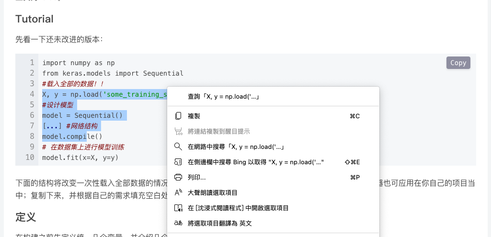

# blog.csdn.net without login

偶爾會在[blog.csdn.net](http://blog.csdn.net)上看到別人的教學，但不知道從什麼時候開始，只有登入才能選取/複製程式碼的部分了...

實在是覺得有點麻煩，所以寫了這個工具來繞過限制

## Features

- "登入後複製"的懸浮按鈕會變成"Copy"，點擊後不會提示登入，會直接複製Code Block中的所有文字

- 可以任意選取Code Block中的文字

Demo:

## Usage (Chrome, Edge)

1. `git clone https://github.com/lebr0nli/blog-csdn-without-login.git` or [download the zip](https://github.com/lebr0nli/blog-csdn-without-login/archive/refs/heads/main.zip)

2. Open `chrome://extensions` or `edge://extensions` in a new tab.

3. Enable `"Developer mode"` at the top-right of your Chrome or left of your Edge.

4. Drag this folder(`blog-csdn-without-login/`) into the page or click the `"Load unpacked"` button that just appeared then select the folder.

5. Enjoy!

## Usage (iOS/iPadOS/MacOS Safari)

1. Download [userscripts](https://apps.apple.com/us/app/userscripts/id1463298887)

2. Read the [docs](https://github.com/quoid/userscripts#userscripts-safari) of userscripts and enable userscripts on your device

3. Open [blog-csdn-without-login.user.js](https://raw.githubusercontent.com/lebr0nli/blog-csdn-without-login/main/userscripts/blog-csdn-without-login.user.js) in a new tab and open userscripts in your safari to download this extension

4. Enjoy!
